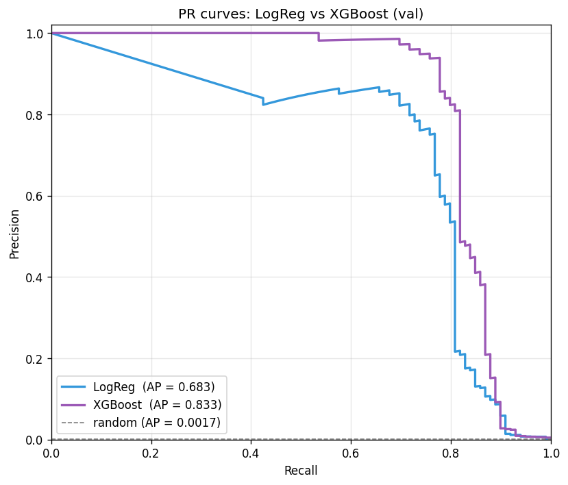
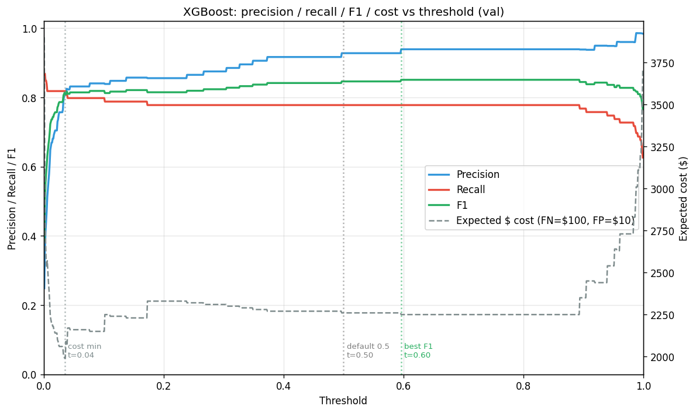

# Credit Card Fraud Detection

End-to-end machine learning project: stratified data pipeline → XGBoost classifier with cost-tuned decision threshold → FastAPI inference service → Next.js + Tailwind interactive frontend.

**Headline result: PR-AUC 0.877 on a held-out test set** (validation 0.833, baseline logistic regression 0.683).

## 🚀 Live demo

| Layer | URL |
|---|---|
| **Web app** (Vercel) | **https://credit-card-fraud-detection-ml.vercel.app** |
| API (Render) | https://fraud-detection-api-r7y4.onrender.com |
| Swagger UI | https://fraud-detection-api-r7y4.onrender.com/docs |

Click any of the three sample buttons in the web app to see the model classify a real test-set transaction. The **"borderline"** sample is the most interesting — it's an actual *legitimate* purchase that the model still flags as fraud, demonstrating the cost-tuning trade-off in action.

> **Heads up on cold starts.** The Render free tier spins down after 15 min of idle. The first prediction after a long quiet period takes ~30–60s while the container restarts. Subsequent calls return in under a second.

You can also call the API directly:

```bash
curl -X POST https://fraud-detection-api-r7y4.onrender.com/predict \
  -H "Content-Type: application/json" \
  -d '{"Time":57007,"Amount":0.01,"V1":-1.271244,"V2":2.462675,"V3":-2.851395,"V4":2.32448,"V5":-1.372245,"V6":-0.948196,"V7":-3.065234,"V8":1.166927,"V9":-2.268771,"V10":-4.881143,"V11":2.255147,"V12":-4.686387,"V13":0.652375,"V14":-6.174288,"V15":0.59438,"V16":-4.849692,"V17":-6.536521,"V18":-3.119094,"V19":1.715494,"V20":0.560478,"V21":0.652941,"V22":0.081931,"V23":-0.221348,"V24":-0.523582,"V25":0.224228,"V26":0.756335,"V27":0.6328,"V28":0.250187}'
```

→ `{"fraud_probability":0.9998,"is_fraud":true,"threshold":0.035,"model_name":"xgboost_v1"}` (a $0.01 card-testing fraud pattern).

---

## What's interesting about this project

- **Realistic class imbalance.** 0.17% fraud rate (1 in 578 transactions). The choice of metrics, splits, sampling strategy, and threshold all flow from this single fact.
- **Imbalance handling validated empirically.** A four-way bake-off (`scale_pos_weight` vs SMOTE vs undersampling vs nothing) confirms the choice — see [Phase 2.5](#phase-25--imbalance-strategy-bake-off) below.
- **Cost-minimizing threshold tuning.** Threshold = 0.035 chosen by minimizing `100·FN + 10·FP` on the validation set. Threshold 0.5 is rarely optimal under heavy imbalance.
- **Strict three-layer architecture.** ML pipeline (`src/`) is imported by the API (`app/`) which is consumed by the web client (`web/`). One-way dependencies, no circular references.
- **Reproducible by commit.** Each phase is a single commit with a focused message — `git log --oneline` is a guided tour through the project.

---

## Results

### Final test-set performance (XGBoost, threshold = 0.035)

| Metric | Value | Note |
|---|---|---|
| **PR-AUC** | **0.877** | Primary metric — robust under extreme imbalance |
| ROC-AUC | 0.976 | Inflated by class imbalance; reported for completeness |
| Precision | 0.720 | 72% of fraud alerts are real fraud |
| Recall | 0.867 | Caught 85 of 98 fraud cases on the test set |
| F1 | 0.787 | |
| Confusion (TP / FP / FN / TN) | 85 / 33 / 13 / 56,831 | Out of 56,962 test transactions |

### Model comparison

| Model | Validation PR-AUC | Note |
|---|---|---|
| Logistic regression baseline | 0.683 | `class_weight='balanced'` |
| **XGBoost (chosen)** | **0.833** | `scale_pos_weight=578` |

The full PR-curve comparison:



XGBoost dominates the entire curve, not just at one threshold.

### Threshold sweep

The threshold choice is a separate decision after training. For our cost model (FN = $100, FP = $10), the cost-minimizing threshold is 0.035 — well below the conventional 0.5. **Recall is capped at ~0.89 even at threshold ≈ 0**, meaning ~10 fraud cases on val are essentially invisible to this model and would require a *better model* (not a different threshold) to recover.



---

## Architecture

```
┌──────────────────────┐    HTTP/JSON    ┌─────────────────────┐
│   web/  (Next.js)    │  ─────────────▶ │   app/  (FastAPI)   │
│   React + Tailwind   │  ◀───────────── │   /predict /health  │
│   localhost:3000     │                 │   localhost:8000    │
└──────────────────────┘                 └──────────┬──────────┘
                                                     │ joblib.load
                                                     ▼
                                         ┌─────────────────────┐
                                         │   models/           │
                                         │   fraud_model.joblib│
                                         │   (preprocessor +   │
                                         │    XGBoost +        │
                                         │    threshold +      │
                                         │    metadata)        │
                                         └──────────┬──────────┘
                                                     │ trained by
                                                     ▼
                                         ┌─────────────────────┐
                                         │   src/  (Python)    │
                                         │   data, training,   │
                                         │   metrics, tuning   │
                                         └─────────────────────┘
```

**Layering rules:**
- `app/` imports from `src/` (never the reverse)
- `web/` only talks to `app/` over HTTP
- `src/` knows nothing about HTTP

---

## Quickstart

### Prerequisites

- Python 3.13+
- Node.js 18.18+ (tested on 22.16)
- The Kaggle [Credit Card Fraud Detection dataset](https://www.kaggle.com/datasets/mlg-ulb/creditcardfraud) — place `creditcard.csv` in `data/raw/`

### 1. Set up the Python environment

```bash
git clone https://github.com/Kaushik1128/credit_card_fraud_detection_ml.git
cd credit_card_fraud_detection_ml

python -m venv .venv
.venv\Scripts\activate       # Windows; on macOS/Linux: source .venv/bin/activate
pip install -r requirements.txt
```

### 2. Build the model artifact

```bash
python -m src.split_data        # creates data/processed/{train,val,test}.parquet
python -m src.train_xgboost     # produces models/xgboost_baseline.joblib
python -m src.tune_threshold    # picks the operating threshold
python -m src.finalize_model    # bundles everything into models/fraud_model.joblib
```

### 3. Run the FastAPI service

```bash
python -m uvicorn app.main:app --reload
```

Visit:
- http://127.0.0.1:8000/docs — auto-generated Swagger UI
- http://127.0.0.1:8000/health — liveness check
- http://127.0.0.1:8000/model-info — model metadata

### 4. Run the Next.js frontend (separate terminal)

```bash
cd web
npm install
npm run dev
```

Open http://localhost:3000 — click any sample to see the API in action.

---

## Project structure

```
credit_card_fraud_detection_ml/
├── data/
│   ├── raw/creditcard.csv           ← dataset (gitignored, 150 MB)
│   └── processed/                   ← train/val/test splits (gitignored)
├── models/                          ← .joblib files gitignored, .json metrics committed
├── notebooks/
│   ├── 01_eda.ipynb                 ← exploratory analysis with narrated findings
│   └── figures/                     ← saved plots (committed for GitHub rendering)
├── src/                             ← ML layer
│   ├── data.py                      ← load, split, preprocess
│   ├── metrics.py                   ← evaluate(), plotting helpers
│   ├── train_logreg.py              ← baseline
│   ├── train_xgboost.py             ← contender
│   ├── compare_imbalance.py         ← strategy bake-off
│   ├── tune_threshold.py            ← threshold sweep
│   ├── finalize_model.py            ← assembles the production bundle
│   └── model.py                     ← inference helpers used by the API
├── app/                             ← API layer
│   ├── main.py                      ← FastAPI app, endpoints, lifespan loader
│   └── schemas.py                   ← Pydantic request/response models
├── web/                             ← Frontend layer (Next.js)
│   └── src/
│       ├── app/page.tsx             ← UI
│       └── lib/                     ← types.ts, api.ts, samples.ts
├── requirements.txt                 ← pinned Python dependencies
└── README.md
```

---

## The journey, commit by commit

Each commit captures one focused phase:

| Phase | Commit | What it accomplished |
|---|---|---|
| 1 | `508a88e` | Project setup, `.gitignore`, pinned dependencies |
| 2.1 | `3b78a55` | EDA notebook — class imbalance, distributions, correlations |
| 2.2 | `ea25449` | Stratified 60/20/20 splits and preprocessor |
| 2.3 | `8e3e802` | Baseline logistic regression (PR-AUC 0.683) |
| 2.4 | `0f2f74a` | XGBoost contender (PR-AUC 0.833 — +22%) |
| 2.5 | `1723ec5` | Imbalance strategy bake-off — `scale_pos_weight` wins |
| 2.6 | `0fda4cc` | Threshold tuning — cost-minimizing t = 0.035 |
| 2.7 | `468216b` | Finalize bundle, score on test (PR-AUC **0.877**) |
| 3 | `45adf9f` | FastAPI service with Pydantic validation |
| 4 | `d55e1ba` | Next.js + Tailwind frontend |
| 5.1 | `89fde78` | README — project front door |
| 5.2 | `6948969` | pytest suite (15 tests, found one real bug in `/predict/batch`) |
| 5.3 | `201b541` | Dockerfile + `.dockerignore` + `requirements-prod.txt` |
| 5.4 | `0167665` | Render Blueprint, model bundle un-gitignored — **API deployed live** |
| 5.5 | *this commit* | Frontend deployed to Vercel — **end-to-end public demo live** |

Run `git log --oneline` to see them all, or `git show <hash>` for any commit's full diff.

---

### Phase 2.5 — Imbalance strategy bake-off

For the curious: four imbalance strategies trained on the same XGBoost hyperparameters:

| Strategy | Val PR-AUC | Notes |
|---|---|---|
| `scale_pos_weight` ⭐ | **0.8334** | Winner |
| none | 0.8316 | Trees handle imbalance natively — surprisingly close |
| SMOTE | 0.8155 | Synthetic neighbors in PCA space slightly hurt |
| undersample | 0.4886 | Collapsed — only ~590 training rows |

Key insight: **trees are far less imbalance-sensitive than logistic regression.** "Do nothing" almost matched `scale_pos_weight`. SMOTE — often recommended without qualification — actively hurt here. Undersampling threw away too much information. See [`src/compare_imbalance.py`](src/compare_imbalance.py) for the bake-off.

---

## Tech stack

**ML / data**: Python 3.13 · scikit-learn 1.8 · XGBoost 3.2 · pandas 3.0 · imbalanced-learn 0.14 · matplotlib · seaborn

**API**: FastAPI 0.136 · Pydantic 2.13 · uvicorn 0.46

**Frontend**: Next.js 16.2 · React 19.2 · TypeScript 5 · Tailwind CSS 4 · Turbopack (dev)

---

## License

MIT — see `LICENSE` (to be added in 5.x if desired).
